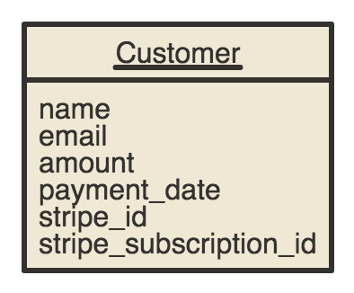

# Platzi Project

This repo contains code of `Platzi Test Project` assigned by Juan Pablo Rojas. It's made with [Django](https://www.djangoproject.com/) a [Python](https://www.python.org/) Web Framework.

The problem to solve is the following:

```
Which is to create a website in Django that allows charging through Stripe a
monthly subscription of 29 USD and store in database: name and email of the buyer,
the amount paid by the user, when it paid and the ID Stripe recurrent customer.

The site should be developed using Docker, MySQL, unit testing and Stripe API.
```

## Setup Project

### Requirements

  - Install [Docker](https://docs.docker.com/engine/installation/)
  - Install [Docker Compose](https://docs.docker.com/compose/install/)

### Run project

Run the command: `./run_dev.sh`

So, the project will be running at [http://localhost:8000](http://localhost:8000)

## Environments

  - `dev`:  with the development environment (DEBUG option is enabled, and database is storage at local volumes).

### Available Containers

  - `mysql`: a mysql database, that share a local volume called `data`
  - `django`: the django project container, with Python at version 3.4 and Django 1.10.2

## Tests

To run unit tests of django project, run the following command: `docker-compose run django ./manage.py test`

## Commands

To run commands that provides Django, you need to always put `compose docker-run django / manage.py` before the command.
For example to create a super user command would be as follows:.` compose docker-run django. /manage.py createsuperuser`

## Models



---
Created with :heart: by [yoelfme](http://github.com/yoelfme)
